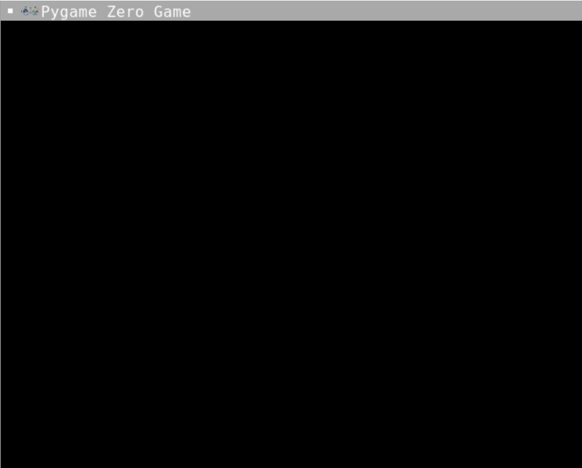

# Pygame Zero - Make a screen

Let’s get Flappy!
Have you heard of the game Flappy Bird, and how it went viral on the internet? It is so wonderfully simple but a fun game to play.
Let’s make our own version called Flappy Brick, it can be as easy or as hard as we want!

## Pre-knowledge
You'll need to know some things before you write your first PygameZero program. You can learn these in this tutorial [A Python Tutorial, the Basics](https://replit.com/talk/learn/A-Python-Tutorial-the-Basics/80394). Specifically you're going to need:
- indentation
- print
- variables
- if statements

We're going to learn about functions but if you've seen them before it will help.

## What is Pygame Zero
Pygame Zero is a special wrapper program that sits around Pygame - Python's game making engine. It was specifically made to make Pygame easier to write for students. You can read the docs here: [Pygame Zero Docs](https://pygame-zero.readthedocs.io/en/stable/)

## The Game
You start with some comments in your code file. They are there because they show the basic shape of the game. If you accidentally lose your comments or delete them you can find them here:

```
#SETUP PYGAME ZERO
#SCREEN
#SETUP SCORE
#SETUP BRICK
#SETUP WALLS
#BUTTON PRESSES
#DRAW STUFF TO SCREEN
#EACH CYCLE THROUGH THE LOOP
    #COLLISIONS
#RESET

#RUN PYGAME ZERO
```
## A Blank Screen
The first thing we're going to do is import pygame zero, set a size for our screen and run Pygame Zero.

#### 1. Go to the section under your `#SETUP PYGAME ZERO` comment
#### 2. To add the Pygame features, add this line under `# SETUP PYGAME ZERO`:
```import pgzrun```

## Pygame Zero Magic
Pygame Zero has some features that mean you don't need to remember a whole lot of Pygame syntax to make the game but there are some gotchas. We set the screen size (width and height) with the two specific variables:
***WIDTH and HEIGHT*** - case sensitive.

```
WIDTH = 100
HEIGHT = 100
```
***You can change the numbers to change the size of the screen.***

#### 3. Go to the section labelled `#SCREEN` and add WIDTH of 800 and HEIGHT of 600

## Why doesn't it run?
Pygame zero is a bit special so it needs a line of code at the very bottom of the .py file to know how to run the code. This line is ```pgzrun.go()```

#### 4. Go to the section labelled `#RUN PYGAME ZERO` and add this special line
```
pgzrun.go()
```

## Run your code!
It should look like this:


If not you can see what the code should look like here (don't peek unless you need to)
<details>
<summary> 👀 Answer</summary>

  ``` python
#SETUP PYGAME ZERO
import pgzrun
#SCREEN
WIDTH = 800
HEIGHT = 600

#SETUP SCORE
#SETUP BRICK
#SETUP WALLS
#BUTTON PRESSES
#DRAW STUFF TO SCREEN
#EACH CYCLE THROUGH THE LOOP
  #COLLISIONS
#RESET

#RUN PYGAME ZERO
pgzrun.go()
```
</details>