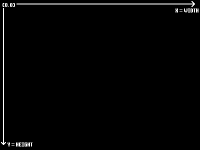
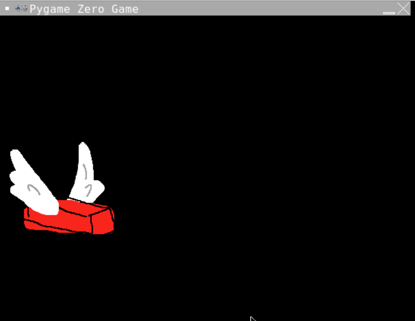

# Create a Flying Brick
*Goal: Create a brick and draw it to the screen.*

## Let's load the brick and draw it to the screen
### 1. Go to the #SETUP BRICK section
We're going to make a new **Actor** and give it an image. You already have an Images folder with the images for the game. 

```python
brick = Actor("brick")
```
*Pygame zero has some magic in it that means we don't need to add the extension for an image if it is a png file*
### 2. Position the Brick
The x and y coordinates for the screen are different from what you might imagine...

The screen has x = 0 and y = 0 at the top left. We need to place the brick in a position greater than (0,0)
We set the position of the brick either by setting a tuple or by setting x or y separately. 
```python
brick.x = 0
brick.y = 0
```
**Change the numbers to place the brick so it is 90 from the left of the screen and 250 from the top of the screen - or choose your own position.**
### 3. Draw the Brick to the screen
In the `#DRAW STUFF TO SCREEN` section we need a new function called draw. Add the following code:
```python
def draw():
```
*Pygame zero has some magic that means it runs this function automatically each frame so everythign we want to appear on the screen should go in here.*

Draw flappy brick by putting the following code indented inside the draw function:
```python
  brick.draw() 
```
### 4. Run your code
It should look like this:


If not you can see what the code should look like here (don't peek unless you need to)

<details>
<summary> 👀 Answer</summary>

  ``` python
#SETUP PYGAME ZERO
import pgzrun
#SCREEN
WIDTH = 600
HEIGHT = 400

#SETUP SCORE
#SETUP BRICK
brick = Actor("brick")
brick.x = 90
brick.y = 250
#SETUP WALLS
#SET SPEED
#BUTTON PRESSES
#DRAW STUFF TO SCREEN
def draw():
    brick.draw()
#EACH CYCLE THROUGH THE LOOP
    #COLLISIONS
#RESET

#RUN PYGAME ZERO
pgzrun.go()
```
</details>