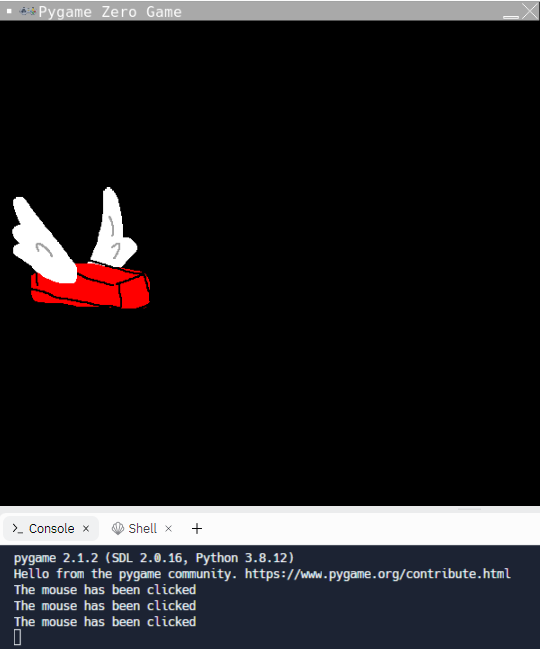
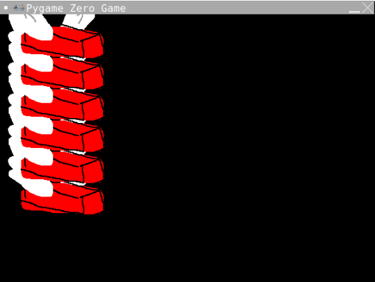

# Move the brick on a mouse click
We want to have the bird move down all the time and jump up a bit when we click the mouse. We'll do this in two steps... Move up when the mouse is slicked and then move down all the time.
## Move up when the mouse is clicked
Pygame Zero has event handlers that manage when events have happened. This is super handy for making games. The event we're looking for is when the mouse is clicked. This is called `on_mouse_down` you can guess what the event is called when the mouse button is released... that's right! `on_mouse_up`.
### 1. Make a new function called `on_mouse_down`:
We need a new function to manage the button being pressed. Find the section labelled with the comment `#BUTTON PRESSES`
Add this code:
```python
def on_mouse_down():
```
***Side note:** You can discover the x and y position of the mouse click if you put the word pos into the brackets `def on_mouse_down(pos):` but for Flappy Brick we don't need to know **where** the player has clicked just **that** they have clicked.* 

### 2. Add a print statement

Just for now we're going to print to the terminal when the mouse is clicked to make sure everything is working. Add this line indented under the definition of our function `on_mouse_down()`:
```python
  print("The mouse has been clicked")
```
### 3. Run your code
It should look like this:


If not you can see what the code should look like here (don't peek unless you need to)

<details>
<summary> 👀 Answer</summary>

  ``` python
#SETUP PYGAME ZERO
import pgzrun
#SCREEN
WIDTH = 600
HEIGHT = 400

#SETUP SCORE
#SETUP BRICK
brick = Actor("brick")
brick.x = 90
brick.y = 250
#SETUP WALLS
#SET SPEED
#BUTTON PRESSES
def on_mouse_down():
    print("The mouse has been clicked")
#DRAW STUFF TO SCREEN
def draw():
    brick.draw()
#EACH CYCLE THROUGH THE LOOP
    #COLLISIONS
#RESET

#RUN PYGAME ZERO
pgzrun.go()
```
</details>

### 4. Make the brick move up
Instead of printing to screen each time we click the mouse want to change the y value of the brick. 

***Remember:** The y value is 0 at the **top** of the screen so we need to **reduce** y each time the mouse is clicked*

Replace the line `print("The mouse has been clicked")` with the following:
```python
  brick.y = brick.y - 50
```
***HINT:** don't forget your indentation!*

### 5. Run your code
It should look like this:


## OH NO! My game is broken!
Not broken - just mildly sprained. Easily fixed.
The problem here is that while you are drawing the brick each time in a different position you're not clearing the screen in between to make sure there is only one brick shown.
### 6. Fill the screen each time
Find these lines of code:
```python
def draw():
  brick.draw()
```
In between these two lines we are going to fill the screen with the colour black. Add this line - making sure you line it up with the indentation of `brick.draw() `
```python
  screen.fill("black")
```
***HINT:** You don't have to always fill the screen with black. There are tonnes of named colours (you can find them **[here](https://pygame-zero.readthedocs.io/en/latest/colors_ref.html)** or you can use rgb or hex codes. You can also make an image the background but that's out of the scope of the tutorial.*

### 5. Run your code
It should now work as expected when you click the mouse. 

If not you can see what the code should look like here (don't peek unless you need to)

<details>
<summary> 👀 Answer</summary>

  ``` python
#SETUP PYGAME ZERO
import pgzrun
#SCREEN
WIDTH = 600
HEIGHT = 400

#SETUP SCORE
#SETUP BRICK
brick = Actor("brick")
brick.x = 90
brick.y = 250
#SETUP WALLS
#BUTTON PRESSES
def on_mouse_down():
    brick.y = brick.y - 50
#DRAW STUFF TO SCREEN
def draw():
    screen.fill("black")
    brick.draw()
#EACH CYCLE THROUGH THE LOOP
    #COLLISIONS
#RESET

#RUN PYGAME ZERO
pgzrun.go()
```
</details>