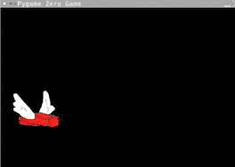

# Dropping off the bottom of the screen
## How can we tell if the brick got too low?
Now that we have the brick moving down we need to detect when it collides with the bottom of the screen. 
Remember that the y coordinate tells us how high the brick is on the screen. Remember that our screen size is 600. 

*The top of the screen has a y coordinate of 0 and the bottom of the screen has a y coordinate of 600.* 
### 1. Adding an if statement
Go to the section labelled **#COLLISIONS** and add an if statement to check if the y value of the brick is > 600. Remember to keep your indentation right, it needs to be indented to line up with the #COLLISIONS comment.
```python
    if brick.y > 600:
```
Now we need to decide what to do when the brick gets to the bottom of the screen. We're going to call a reset function. 
```python
        reset()
```
***Note:** We haven't written the reset function yet so if you run your code you will see an error.*
```python
Traceback (most recent call last):
  File "main.py", line 30, in <module>
    pgzrun.go()
  File "/home/runner/FlappyBrick/venv/lib/python3.8/site-packages/pgzrun.py", line 31, in go
    run_mod(mod)
  File "/home/runner/FlappyBrick/venv/lib/python3.8/site-packages/pgzero/runner.py", line 113, in run_mod
    PGZeroGame(mod).run()
  File "/home/runner/FlappyBrick/venv/lib/python3.8/site-packages/pgzero/game.py", line 217, in run
    self.mainloop()
  File "/home/runner/FlappyBrick/venv/lib/python3.8/site-packages/pgzero/game.py", line 252, in mainloop
    update(dt)
  File "/home/runner/FlappyBrick/venv/lib/python3.8/site-packages/pgzero/game.py", line 194, in <lambda>
    return lambda dt: update()
  File "main.py", line 26, in update
    reset()
NameError: name 'reset' is not defined
```
# DON'T PANIC!
The last line is the most useful piece of the error and it's telling us that the **reset()** function doesn't exist. How about we make that?

### 2. Writing the reset function
Go to the section labelled **#RESET** and define a function called `reset()`.
```python
def reset():
```
What do we want to do whenever the game resets? We want to tell the player. Then we want to put the brick back to it's starting position. We're going to use a print statement and then set the values of the y value of the brick. Watch your indentation - these lines are indented one step from the function definition.
```python
  print("The game is resetting!")
  brick.y = 250
```

## Run your code!
It should look like this:


If not you can see what the code should look like here (don't peek unless you need to)
<details>
<summary> 👀 Answer</summary>

  ``` python
#SETUP PYGAME ZERO
import pgzrun
#SCREEN
WIDTH = 600
HEIGHT = 400

#SETUP SCORE
#SETUP BRICK
brick = Actor("brick")
brick.x = 90
brick.y = 250
#SETUP WALLS
#BUTTON PRESSES
def on_mouse_down():
    brick.y = brick.y - 50
#DRAW STUFF TO SCREEN
def draw():
  screen.fill("black")
  brick.draw()
#EACH CYCLE THROUGH THE LOOP
def update():
    brick.y = brick.y + 1
    #COLLISIONS
    if brick.y > 600:
        reset()
#RESET
def reset():
    print("The game is resetting")
    brick.y = 250
#RUN PYGAME ZERO
pgzrun.go()
```
</details>