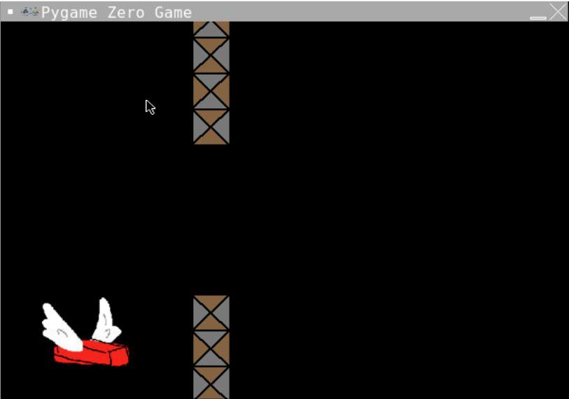
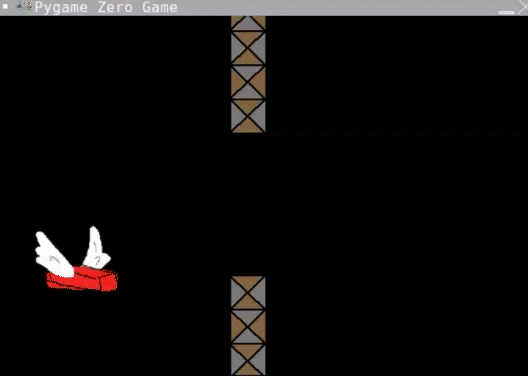

# Walls that Move!
Now that we have our flappy brick, and our flappy brick moves up and down and resets at the bottom of the screen, we need some obstacles to avoid. 

## Goal: Let’s create some walls that move across the screen!

We need to set-up our walls (things to avoid)! So we need to decide some information about them.

What do we need to know about walls?
Walls have 4 pieces of information we’re going to set
- Actor: Whether the wall is an "up" wall or "down" wall
- Left coordinate: the left position of the top left hand corner of the wall 
- Top Coordinate: the top position of the top left hand corner of the wall 
- Gap: the distance between the top wall and the bottom wall

### 1. Starting position
Go to the section labelled **#SETUP WALLS** we need to make 2 new Actors.
```python
wall_top = Actor("wall-top")
wall_bottom = Actor("wall-bottom")
```
We also need a new variable called `gap`. This number will determine the gap between the top and bottom walls.
```python
gap = 150
```
Give wall_top an x value of 300 and a y value of 0
```python
wall_top.x = 300
wall_top.y = 0
```
Set `wall_bottom` to have the **same x value** and then we're going to use some maths to set the y value...
```python
wall_bottom.y = wall_top.height + gap
```
### 2. Drawing to the screen
Go to the draw function. After the line `brick.draw()` we're going to draw the walls. Don't forget to watch your indentation.
```python
    wall_top.draw()
    wall_bottom.draw()
```
### 3. Run your code
It should look like this:


### 4. Moving those walls.
Just like how the brick always moves down because we add to its y value each update we need to change the x value of both walls each update.

Go to the update function.
In between this line `brick.y = brick.y + 1` and `#COLLISIONS` we're going to minus one from the walls x value...
```python
    wall_top.x = wall_top.x - 1
    wall_bottom.x = wall_bottom.x - 1
```
### 5. Run your code
It should look like this:


If not you can see what the code should look like here (don't peek unless you need to)
<details>
<summary> 👀 Answer</summary>

  ``` python
#SETUP PYGAME ZERO
import pgzrun
#SCREEN
WIDTH = 600
HEIGHT = 400

#SETUP SCORE
#SETUP BRICK
brick = Actor("brick")
brick.x = 90
brick.y = 250
#SETUP WALLS
wall_top = Actor("wall-top")
wall_bottom = Actor("wall-bottom")
gap = 150
wall_top.x = 300
wall_top.y = 0
wall_bottom.x = 300
wall_bottom.y = wall_top.height + gap
#BUTTON PRESSES
def on_mouse_down():
    brick.y = brick.y - 50
#DRAW STUFF TO SCREEN
def draw():
    screen.fill("black")
    brick.draw()
    wall_top.draw()
    wall_bottom.draw()
#EACH CYCLE THROUGH THE LOOP
def update():
    brick.y = brick.y + 1
    wall_top.x = wall_top.x - 1
    wall_bottom.x = wall_bottom.x - 1
    #COLLISIONS
    if brick.y > 600:
        reset()
#RESET
def reset():
    print("The game is resetting")
    brick.y = 250
#RUN PYGAME ZERO
pgzrun.go()
```
</details>