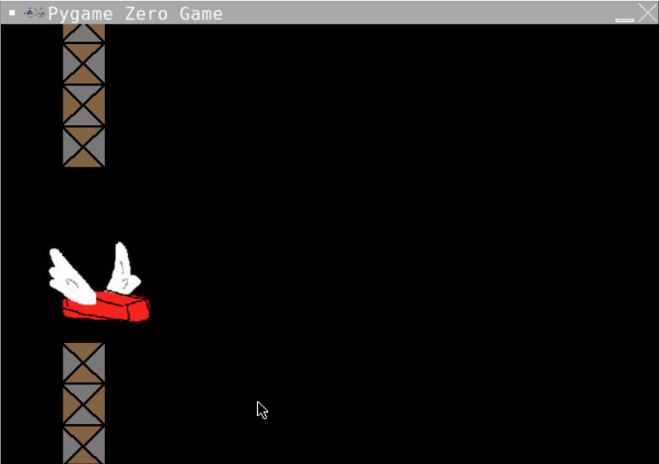
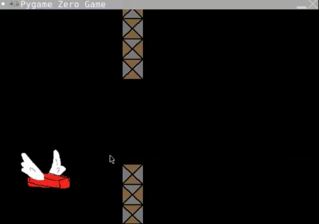

# Collisions with walls
We want the brick to reset when it collides with a wall the same way that it resets when it collides with the "floor". We do this a similar way. 

There's some pretty funky mathematics required to check if two rectangles intersect. Pygame Zero has some magic to help us here - it has functions that check for collisions between two Actors.

We're going to use `actor.colliderect(second_actor)`.

### 1. Make the if statement
***New Information:** If statements can be made up of multiple tests (called conditions) linked with `or` or `and`. We're going to use `or` to check if the brick is touching either the top wall or the bottom wall.*

Find the section labelled `#COLLISIONS`. Underneath the if statement that checks if the brick drops too low we're going to put a new if statement. Indentation gets tricky here. We need to ensure the second if statement if lined up with the first if statement.

```python
    if brick.colliderect(wall_top) or brick.colliderect(wall_bottom):
        reset()
```
### 2. Run your code
You should notice that when you collide with a wall the brick returns to the starting position and then kind of freezes while the wall goes past. We need to reset the wall position to its starting position in the reset function.



### 3. Reset the walls
When we rest the brick's position we set it's y value to its beginning position. To reset the walls' positions we need to set the x value of both walls.
Find the function called `reset()`. 
Add these lines underneath `brick.y = 250` make sure the indentation lines up.
```python
    wall_top.x = 300
    wall_bottom.x = 300
```
## Run your code!
It should look like this:


If not you can see what the code should look like here (don't peek unless you need to)
<details>
<summary> 👀 Answer</summary>

  ``` python
#SETUP PYGAME ZERO
import pgzrun
#SCREEN
WIDTH = 600
HEIGHT = 400

#SETUP SCORE
#SETUP BRICK
brick = Actor("brick")
brick.x = 90
brick.y = 250
#SETUP WALLS
wall_top = Actor("wall-top")
wall_bottom = Actor("wall-bottom")
gap = 150
wall_top.x = 300
wall_top.y = 0
wall_bottom.x = 300
wall_bottom.y = wall_top.height + gap
#BUTTON PRESSES
def on_mouse_down():
    brick.y = brick.y - 50
#DRAW STUFF TO SCREEN
def draw():
    screen.fill("black")
    brick.draw()
    wall_top.draw()
    wall_bottom.draw()
#EACH CYCLE THROUGH THE LOOP
def update():
    brick.y = brick.y + 1
    wall_top.x = wall_top.x - 1
    wall_bottom.x = wall_bottom.x - 1
    #COLLISIONS
    if brick.colliderect(wall_top) or brick.colliderect(wall_bottom):
        reset()
    if brick.y > 600:
        reset()
#RESET
def reset():
    print("The game is resetting")
    brick.y = 250
    wall_top.x = 300
    wall_bottom.x = 300
#RUN PYGAME ZERO
pgzrun.go()
```
</details>