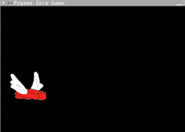

# Make more walls
Currently when the walls get to the edge of the screen they disappear and we never see them again. This is not ideal. We'd like these walls to go back to the right hand side of the screen and keep moving.

This is similar to what we do when the brick gets to the bottom of the screen and we reset it to the beginning position - only we're going to put the walls back to the right of the screen.
### 1. Writing the if statement
Find the section in the update function where we check `if brick.y > 600:` lined up with that if statement under the line `reset()` we're going to check if the walls are at the far left of the screen.
```python
    if wall_top.x < 0:
        reset_walls()
```
### Run your code!
```python
Traceback (most recent call last):
  File "main.py", line 48, in <module>
    pgzrun.go()
  File "/home/runner/FlappyBrick/venv/lib/python3.8/site-packages/pgzrun.py", line 31, in go
    run_mod(mod)
  File "/home/runner/FlappyBrick/venv/lib/python3.8/site-packages/pgzero/runner.py", line 113, in run_mod
    PGZeroGame(mod).run()
  File "/home/runner/FlappyBrick/venv/lib/python3.8/site-packages/pgzero/game.py", line 217, in run
    self.mainloop()
  File "/home/runner/FlappyBrick/venv/lib/python3.8/site-packages/pgzero/game.py", line 252, in mainloop
    update(dt)
  File "/home/runner/FlappyBrick/venv/lib/python3.8/site-packages/pgzero/game.py", line 194, in <lambda>
    return lambda dt: update()
  File "main.py", line 40, in update
    reset_walls()
NameError: name 'reset_walls' is not defined
```

## Don't Panic!
The error is because we need to set up a new function to set the walls to the right side of the screen

### 2. Making a new function
Find the `#RESET` section and under the `reset()` function we're going to define a new function called `reset_walls()`.
```python
def reset_walls():
    wall_top.x = 600
    wall_bottom.x = 600
```
### 3. Randomise the wall height 
We now have a thing that could be called a game - but it's not very fun yet. We need to make sure that each set of walls is a slightly different height so it's more fun. For that we need to use `random`. Go to the very top of your program where you import pgzrun. We're going to import the random library.
```python
import random
```
Now go back to the `reset_walls()` function we just defined. We always want the x value to be 600 because that's the width of the screen but we need to randomise the y value for the top wall and set the bottom wall to be set from that.
Underneath `wall_bottom.x = 600` put the following code:
```python
        wall_top.y = random.randint(-50, 50)
        wall_bottom.y = wall_top.y + wall_top.height + gap
```

### 3. Run the code

It should look like this:


If not you can see what the code should look like here (don't peek unless you need to)
<details>
<summary> 👀 Answer</summary>

  ``` python
#SETUP PYGAME ZERO
import pgzrun
#SCREEN
WIDTH = 600
HEIGHT = 400

#SETUP SCORE
#SETUP BRICK
brick = Actor("brick")
brick.x = 90
brick.y = 250
#SETUP WALLS
wall_top = Actor("wall-top")
wall_bottom = Actor("wall-bottom")
gap = 150
wall_top.x = 300
wall_top.y = 0
wall_bottom.x = 300
wall_bottom.y = wall_top.height + gap
#BUTTON PRESSES
def on_mouse_down():
    brick.y = brick.y - 50
#DRAW STUFF TO SCREEN
def draw():
    screen.fill("black")
    brick.draw()
    wall_top.draw()
    wall_bottom.draw()
#EACH CYCLE THROUGH THE LOOP
def update():
    brick.y = brick.y + 1
    wall_top.x = wall_top.x - 1
    wall_bottom.x = wall_bottom.x - 1
    #COLLISIONS
    if brick.colliderect(wall_top) or brick.colliderect(wall_bottom):
        reset()
    if brick.y > 600:
        reset()
    if wall_top.x < 0:
        reset_walls()
#RESET
def reset():
    print("The game is resetting")
    brick.y = 250
    wall_top.x = 300
    wall_bottom.x = 300
def reset_walls():
    wall_top.x = 600
    wall_bottom.x = 600
    wall_top.y = random.randint(-50, 50)
    wall_bottom.y = wall_top.y + wall_top.height + gap
#RUN PYGAME ZERO
pgzrun.go()
```
</details>