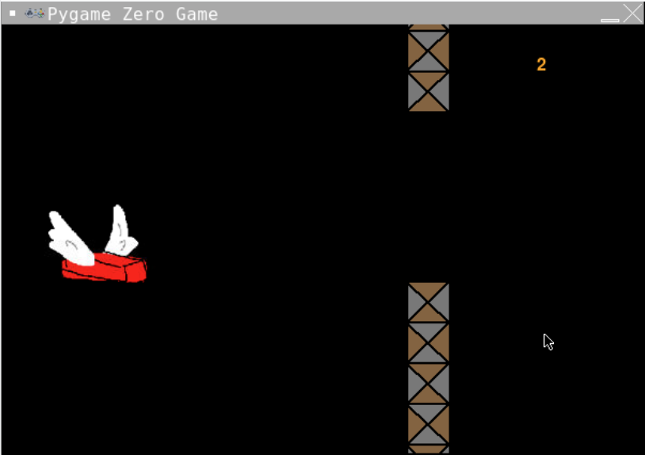

# Scoring and writing text to screen
We now have a game! It's a bit basic but we have all the elements - there's a good guy, there's a challenge, it continues, it has something to keep the player interested. These are all the elements of a great game. Next step it to keep score so players can boast about their skills.

### 1. Storing the score
First thing we need is a variable to keep track of the score. Find the section labelled `#SETUP SCORE` and make a `score` variable and set it to zero.
```python
score = 0
```
We're going to need to **update** the score and **display** the score on the screen.

### 2. Update the score
Bear with me you're going to have to learn about scoping.

***New Information:** In Python a variable cannot be **updated** from within a function unless it is made available to that function. There are a couple of ways to do this but the easiest in Pygame Zero is to make the variable have a **global scope** (i.e. the function knows which variable it is referring to).*

Find the `update()` function. At the top of the function, indented once, before everything else add this line:
```python
  global score
```
Now we can update the score from within this function! Yay.

Find the if statement that checks if the walls are at the edge of the screen. If the walls are at the left edge of the screen then the brick has got past them safely - we can add one to the score. 
*(Note: there are other ways to test for the score being increased but this is for the benefits of simplicity - if you're confident to try another way go right ahead.)*

In between the lines `if wall_top.x < 0:` and 
`reset_walls()` we're going to add 1 to the score.
```python
  score = score + 1
```

Unfortunately we won't be able to know the score because it's not shown anywhere. Let's do that now.

### 3. Display the score
***New Information:** Pygame Zero allows us to write only text to the screen. If we want to display our score we need to convert it to text by using the `str()` function.*

We have a score variable that keeps track of how many walls we have safely passed - now we need to put it on the screen. Go to the `draw()` function.
Underneath where we are drawing the walls we need to add this line:
***
```python
        screen.draw.text(str(score), (500, 30), color="orange")
```
This is a lot of code in one line so I'll explain. `screen.draw.text()` is the function that draws things to the screen. It takes a number of arguments. The first and most important is the text to be displayed - in our case `str(score)`. The second that looks like this `(x,y)` is the position of the centre of the text - in our case x is 500 and y is 30. The third argument is the colour of the text (with American spelling), in our case the colour is orange. 

You can also set the size and some other information about the text - look at the options here: [Pygame docs, text formatting](https://pygame-zero.readthedocs.io/en/stable/ptext.html).

### 4.Reset score when we reset the game.
Go to the function called `reset()` we need to make score global so we can update it. At the top of the function (before `print("The game is resetting")`) write the global declaration:
```python 
    global score
```
Then we can set score to zero:
```python
    score = 0
```
### Run your code!
You made it! You now have a game of Flappy Brick! What would you add to it? Can you work out how to add more fun features to your game?

It should look like this:


If not you can see what the code should look like here (don't peek unless you need to)
<details>
<summary> 👀 Answer</summary>

  ``` python
#SETUP PYGAME ZERO
import pgzrun
import random
#SCREEN
WIDTH = 600
HEIGHT = 400

#SETUP SCORE
score = 0
#SETUP BRICK
brick = Actor("brick")
brick.x = 90
brick.y = 250
#SETUP WALLS
wall_top = Actor("wall-top")
wall_bottom = Actor("wall-bottom")
gap = 150
wall_top.x = 300
wall_top.y = 0
wall_bottom.x = 300
wall_bottom.y = wall_top.height + gap
#BUTTON PRESSES
def on_mouse_down():
    brick.y = brick.y - 50
#DRAW STUFF TO SCREEN
def draw():
    screen.fill("black")
    brick.draw()
    wall_top.draw()
    wall_bottom.draw()
    screen.draw.text(str(score), (500, 30), color="orange")
#EACH CYCLE THROUGH THE LOOP
def update():
    global score
    brick.y = brick.y + 1
    wall_top.x = wall_top.x - 1
    wall_bottom.x = wall_bottom.x - 1
    #COLLISIONS
    if brick.colliderect(wall_top) or brick.colliderect(wall_bottom):
        reset()
    if brick.y > 600:
        reset()
    if wall_top.x < 0:
        score = score + 1
        reset_walls()
#RESET
def reset():
    global score
    score = 0
    print("The game is resetting")
    brick.y = 250
    wall_top.x = 300
    wall_bottom.x = 300
def reset_walls():
    wall_top.x = 600
    wall_bottom.x = 600
    wall_top.y = random.randint(-50, 50)
    wall_bottom.y = wall_top.y + wall_top.height + gap
#RUN PYGAME ZERO
pgzrun.go()
```
</detail>